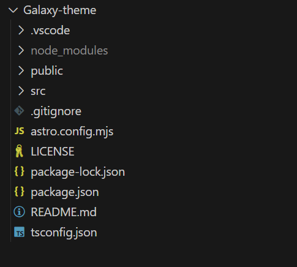

# Galaxy-theme  主题文档  很多东西还没完成
# 声明: 主题配置有些借鉴 [xingwangzhe](https://github.com/xingwangzhe/stalux) ，在此感谢

##  项目配置

### 项目结构  
  

```
galaxy-theme/
├── src/
│   ├── components/         # 组件
│   ├── content/            # 内容
│   │   ├── posts/          # 博客文章(在此放置)
│   │   └── other/          # 其他  
│   ├── images/             # 图片资源
│   ├── layouts/            # 页面布局组件
│   ├── pages/              # 页面路由, 不是放置博客文章的地方
├── astro.config.mjs        # Astro 配置文件
├── package.json            # 项目依赖和脚本
├── tsconfig.json           # TypeScript 配置
├── _galaxy.yml             # 主题默认配置文件
└── README.md               # 项目文档
```

### 项目细节  
- _config.yml 是用户自定义的配置文件，可以覆盖主题的默认配置文件 _galaxy.yml，但主题的默认配置文件 _galaxy.yml 不要动  
创建 Astro 项目时不会直接生成 _galaxy.yml 和 _config.yml ，需要自己手动创建。我没有建 _config.yml ，另外， _galaxy.yml 需要替换为自己的文件名

- 自己做页面，各种各样的组件需要在不同的模块（文件夹）中实现，不是放在一个模块（文件夹）中就可以了

## 参考资源
- [xingwangzhe](https://github.com/xingwangzhe/stalux)
- [Astro 官方文档](https://docs.astro.build/zh-cn/getting-started)
