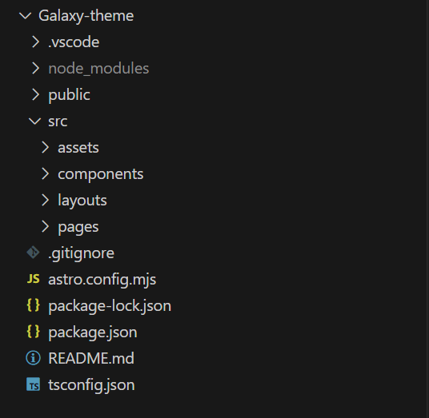

# Galaxy-theme  
# 声明: 主题配置有些借鉴xingwangzhe，在此感谢

## 项目结构  


```
Galaxy-theme
       - src/


```
##  Astro 项目配置
### Astro 项目细节
_config.yml 是用户自定义的配置文件, 可以覆盖主题的默认配置文件 _galaxy.yml, 但主题的默认配置文件 _galaxy.yml 不要动  
创建 Astro 项目时不会直接生成主题的默认配置文件 _galaxy.yml 和 _config.yml 文件, 需要自己手动创建。我没有建 _config.yml 文件, 另外, _galaxy.yml需要替换为自己的文件名
